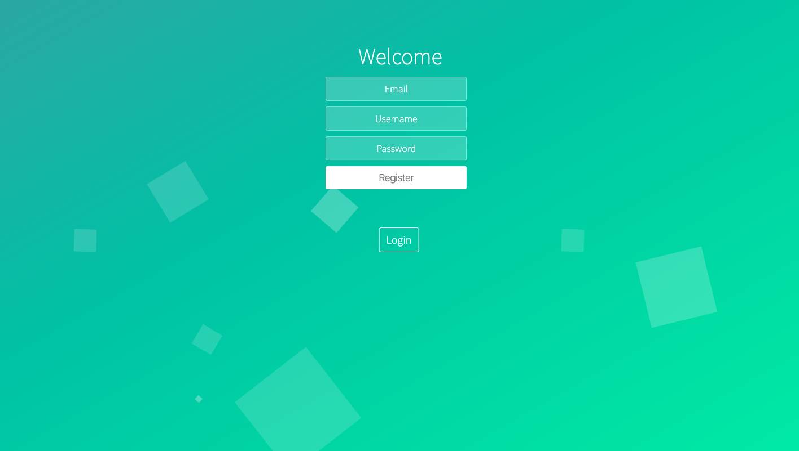
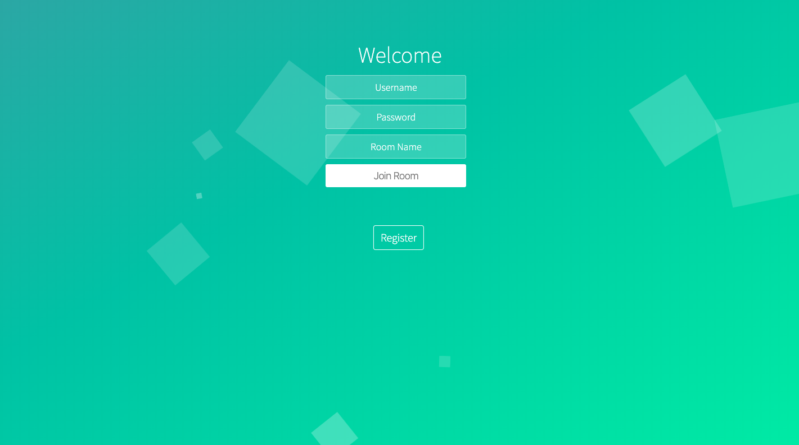
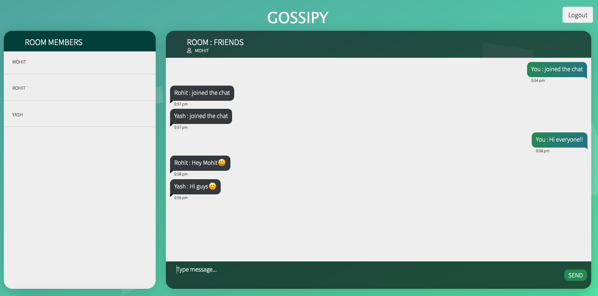

# Gossipy
Gossipy is a real time chat application in nodeJS which uses sockets for real time functionality. 
##
### Key features
 - **Secure** **Authentication** using Passport.js Local Strategy.
 - **Real time** chat messaging using **sockets**.
 - Multiple users can join a chat room by each logging in using their account credentials and room name to be joined.
- Users can type chat messages to the chat room.
- A notification is sent to all users when a user joins or leaves the chatroom. 
##
### Register page
 

### Login page
 

### Home page
 

### Made By
 Harsh Kothari
